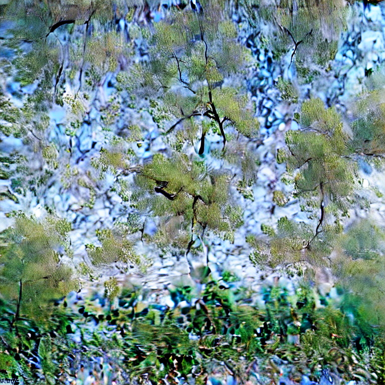
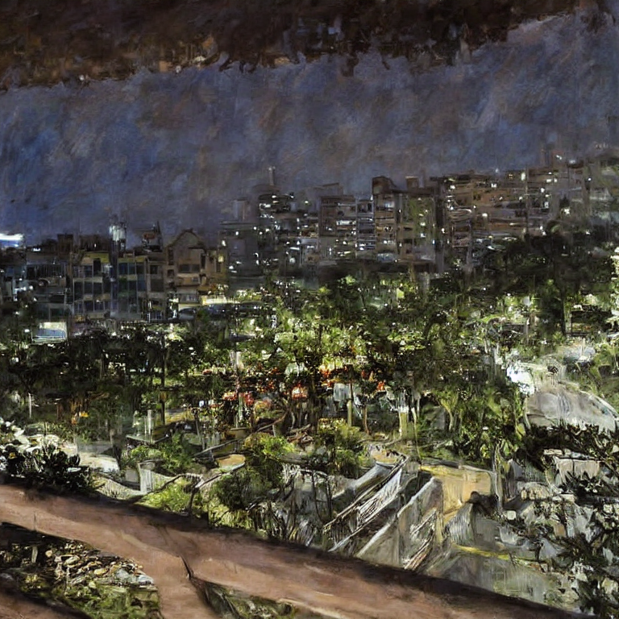
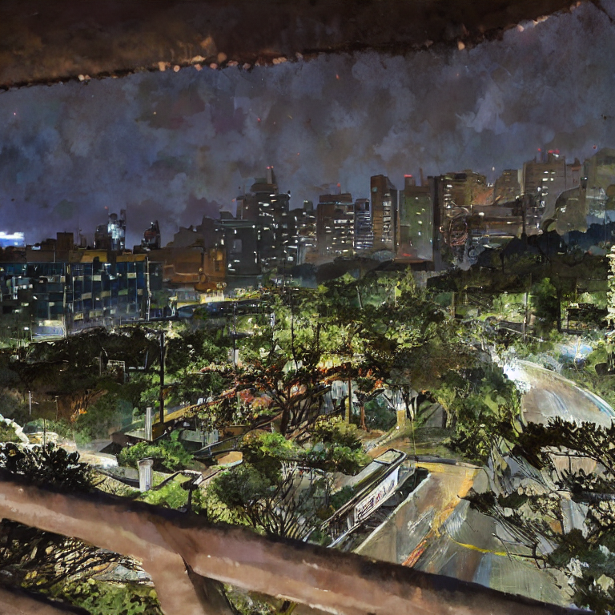
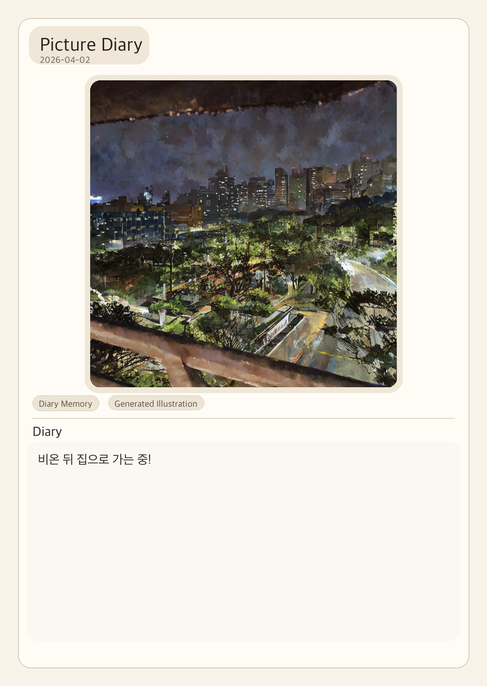

# Multimodal Picture Diary

Diary-to-image Streamlit app that turns diary text and reference photos into stylized picture-diary pages.

**Live Demo**: <https://multimodal-picture-diary-25vtwte77q6nxwtbdhhpp9.streamlit.app/>  
**Model Cards**: [Monet LoRA](https://huggingface.co/J-YOON/lora-monet-sd1.5) | [Animate Landscape LoRA](https://huggingface.co/J-YOON/animate-lora-sd1.5)  
**Tech Stack**: Python, Streamlit, PyTorch, Diffusers, Stable Diffusion 1.5, LoRA

## Overview

This repository focuses on three layers:

1. **Application layer**: a deployable Streamlit app that turns diary text into a stylized diary page.
2. **Generation layer**: Stable Diffusion 1.5 + LoRA adapters hosted on Hugging Face.
3. **Training provenance layer**: preserved config files, logs, and reconstruction notes for the original LoRA training runs.

This repository does **not** vendor the full `kohya_ss` training codebase. Instead, it documents the preserved training conditions as faithfully as possible.

The app repository and the two Hugging Face model repositories are maintained by the same author, but kept separate so the application code, demo assets, and LoRA weights can be versioned independently.

The Streamlit page is included as a lightweight project demo. Because it runs on free hosting, first load and first generation can be noticeably slow.

## References

- Base model: [runwayml/stable-diffusion-v1-5](https://huggingface.co/runwayml/stable-diffusion-v1-5)
- Monet dataset reference: [Kaggle - GAN Getting Started / Monet-style dataset](https://www.kaggle.com/competitions/gan-getting-started/data)
- Animate dataset reference: [Hugging Face - Fung804/makoto-shinkai-picture](https://huggingface.co/datasets/Fung804/makoto-shinkai-picture)

The original LoRA experiments were reconstructed from preserved `kohya_ss`-era configs and logs. Dataset links above are included as public references for the style experiments and preserved training context.

## Run locally

```bash
cd /path/to/Multimodal-Picture-Diary
source .venv/bin/activate
cp .env.example .env
streamlit run app/main.py
```

## User-facing behavior

- No token entry is exposed in the app UI.
- End users only provide diary text and, optionally, a reference image.
- Text-only input uses `txt2img`.
- Reference image input uses `img2img`.

## Demo samples

Prompt used for the curated demo set:

```text
비온 뒤 집으로 가는 중!
```

`text2img`

| Monet | Animate Landscape |
| --- | --- |
|  |  |

`original reference -> img2img`

The `img2img` examples below use structure-preserving reference guidance tuned per style.
Monet uses `denoise_strength=0.25`, while Animate Landscape uses a slightly stronger stylization setting (`denoise_strength=0.32`, `lora_scale=0.95`) so the anime-style background is more visible.
In general, lower `img2img` denoise settings around `0.2-0.3` are intended for broad photo stylization: they preserve much of the original composition while layering the learned visual style on top.
This makes the mode suitable for many everyday reference photos, although results still vary depending on the subject matter and how far it sits from the original LoRA training domain.

<p align="center">
  
</p>

<table>
  <tr>
    <td align="center"><strong>Monet img2img</strong></td>
    <td align="center"><strong>Animate Landscape img2img</strong></td>
  </tr>
  <tr>
    <td></td>
    <td></td>
  </tr>
</table>

Final diary-page export sample from the Streamlit flow:

<p align="center">
  
</p>

Generation settings for these demo assets are recorded under `assets/demo/metadata/`.

## Current limitations and generalization notes

- Korean diary input is supported through prompt planning and template/rule-based scene conversion, not because the diffusion base model or LoRA adapters are strongly Korean-native.
- In practice, this means prompts that match known scene patterns tend to work more reliably, while unfamiliar Korean expressions may produce partially inferred or style-led results.
- OpenAI-based prompt planning can improve dynamic Korean-to-scene conversion, but it introduces external API dependency and potential usage cost.
- The app now includes a `Base model only` option and wider LoRA strength controls so users can reduce style bias and recover more of the foundation model's general object knowledge when needed.
- This is especially relevant for prompts outside the preserved LoRA domains, such as food, indoor objects, or subjects that are weakly represented in the original landscape-oriented adapters.

## Deployer setup

Secrets and model/provider settings are managed by the deployer through `.env` or server environment variables.
This repository is intentionally organized so that Hugging Face and OpenAI tokens stay outside the user-facing interface.

Core deployer settings:

- `HF_TOKEN`: optional but recommended for reliable Hugging Face model access.
- `OPENAI_API_KEY`: needed only if you want AI rewrite or OpenAI-based prompt planning.
- `OPENAI_ENABLED`: enables OpenAI-backed features when set to `true`.
- `PROMPT_PLANNER_MODE`: controls how prompts are designed before diffusion.

### Prompt planning modes

The app supports two prompt-design paths plus an automatic mode:

- `PROMPT_PLANNER_MODE=rule_based`
  Uses built-in keyword rules only. No OpenAI API call is made.
- `PROMPT_PLANNER_MODE=template`
  Uses prebuilt prompt templates such as `library_study`, `urban_walk`, `cafe_reflection`, and `travel_landscape`.
  This is useful when you want reusable prompt plans without writing them yourself.
- `PROMPT_PLANNER_MODE=openai`
  Uses the OpenAI API to dynamically plan `scene / subjects / mood / composition / extra_details`.
- `PROMPT_PLANNER_MODE=auto`
  In this mode, the app behaves like:
  - `OPENAI_ENABLED=true` -> use OpenAI dynamic planning
  - `OPENAI_ENABLED=false` -> use rule-based planning

Recommended deployer configurations:

```env
OPENAI_ENABLED=false
PROMPT_PLANNER_MODE=template
```

```env
OPENAI_ENABLED=true
PROMPT_PLANNER_MODE=openai
OPENAI_API_KEY=sk-...
OPENAI_MODEL=gpt-4.1-mini
```

Notes:

- `Use AI rewrite` is separate from prompt planning.
- If you want zero OpenAI API usage, set `OPENAI_ENABLED=false` and use `rule_based` or `template`.
- If you want dynamic prompts but not hardcoded rules, use `PROMPT_PLANNER_MODE=openai`.
- `template` mode is the easiest non-API option if you want reusable prompt plans without writing them from scratch.

## Suggested deployment split

- **GitHub app repo**: <https://github.com/J-Y00N/Multimodal-Picture-Diary>
- **HF model repos**: <https://huggingface.co/J-YOON/lora-monet-sd1.5>, <https://huggingface.co/J-YOON/animate-lora-sd1.5>
- **HF Space repo**: `multimodal-picture-diary-space` (template included under `hf_repo_skeletons/`)

## Development notes

1. Open this root folder.
2. Create and activate a virtual environment.
3. Fill in `.env` from `.env.example`.
4. Decide whether V1 will be text-only or text + reference image.
5. Implement `src/picture_diary/diffusion/generate.py` first.
6. Connect `app/main.py` only after the generator returns a PIL image reliably.

## Training provenance

See:

- `training/README.md`
- `training/configs/`
- `training/logs/`
- `docs/reproducibility_note.md`

## Hugging Face repo cleanup

See:

- `docs/hf_model_repo_cleanup.md`
- `hf_repo_skeletons/lora-monet-sd1.5/`
- `hf_repo_skeletons/animate-lora-sd1.5/`
- `hf_repo_skeletons/multimodal-picture-diary-space/`
